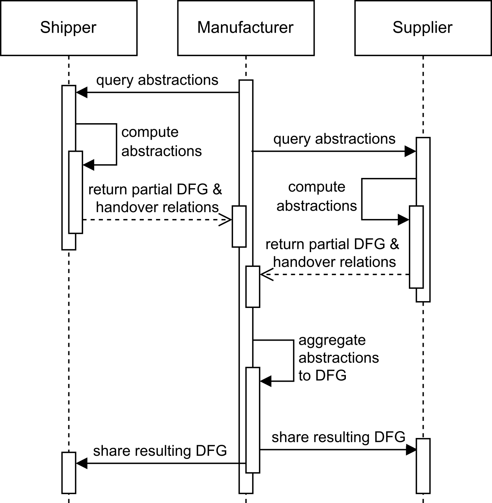

# Federated Process Mining: Computing Directly-Follows Graphs using Abstractions
This repository provides event data and code for the simulation of a supply a chain and code that can be used within
data spaces for the federated computation of a directly-follows graph using abstractions.

## How to Use
We expect a supplier, manufacturer, and shipper to be given within the supply chain.
Together, they want to understand their flow of activities by computing a directly-follows graph.
Initially, each, the manufacturer, supplier, and shipper, are given their local event logs and their handover relations between organizations.

This can be done by moving the [manufacturer](manufacturer), [shipper](shipper), and the [supplier](supplier) file systems to the respective data space.
Further, to each of the data spaces, one has to move the [pp_iopm](pp_iopm) and the [server](server) file systems for additional functionality.

Next, the organizations decide which organizations should act as a server.
This server queries the abstractions and handover relations of the other organizations.
If the abstraction is not already pre-computed, it has to be obtained using the `abstraction_computation.py` scripts.
After transfer of the abstractions and handover relations using the data spaces, the server should have six data files.
A handover relation file and its own abstractions, and the handover relations and the abstractions of the other two organizations, respectively.
Using the `compute_aggregation.py`, the resulting directly-follows graph is computed.
The resulting directly-follows graph can now be shared with the other two organizations.
The result can be loaded and visualized using the `visualize_aggregation.py`.
The overall process of the directly-follows graph computation is shown below.

## Results
In [results](results) the resulting directly-follows graph from the computation are provided for completeness.
Additionally, another version of the same graph that is by hand color-coded for the activities of the different organizations is provided. 

## Preliminary Work
The existing work is based on [1] and therefore, parts of the code are also taken from its Git repository at https://git.rwth-aachen.de/majid.rafiei/pp-iopm/.
The simulated model is adapted from the model used in [2] and taken from https://github.com/m4jidRafiei/Federated_Conformance_Checking/tree/main/CPN.
Using the CPN tools model in [preproce](preprocessing/orig_data/data_simulation), one can create further event data.
The event data is then translated to the XES file format and split for our experiments into the local event logs and the handover relations.

## References 
[1] Rafiei, Majid, and Wil MP Van Der Aalst. "An abstraction-based approach for privacy-aware federated process mining." IEEE Access 11 (2023): 33697-33714.

[2] Rafiei, Majid, Mahsa Pourbafrani, and Wil MP van der Aalst. "Federated conformance checking." Information Systems 131 (2025): 102525.